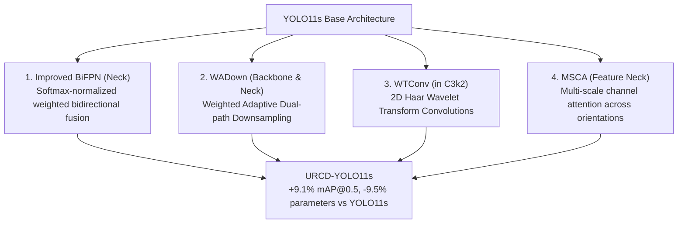

# URCD-YOLO (UAV Road Crack Detection YOLO)

Implementation of **URCD-YOLO** for lightweight, high-precision pavement distress detection in low-altitude UAV aerial imagery.

Based on the anchor paper:
> **Deep learning-based road crack detection for UAV imagery**  
> Weiguo Yi, Longteng Wang, Lingwei Yan  
> *Egyptian Informatics Journal*, vol. 34, art. 100985, 2026.  
> DOI: [10.1016/j.eij.2026.100985](https://doi.org/10.1016/j.eij.2026.100985)

---

## 1. Architectural Innovations

URCD-YOLO builds on **YOLO11s** (5.17M parameters, 13.7 GFLOPs) and introduces four targeted architectural enhancements:



| Module | Location | Mathematical Mechanism | Rationale |
|---|---|---|---|
| **BiFPN_Concat2 / 3** | Neck | $O = \sum \text{Softmax}(w)_i \cdot I_i$ | Replaces rigid concatenation with learnable probability-simplex weighting. Eliminates fusion deviation across scales. |
| **WADown** | Backbone & Neck | Dual path: (AvgPool + $3\times3$ Conv) $\oplus$ (MaxPool + $1\times1$ Conv) with Softmax path gating | Preserves high-frequency crack edge gradients while cutting 50% parameter overhead vs monolithic strided convolutions. |
| **WTConv2d** | `C3k2` Bottlenecks | 2D Haar DWT $\to$ sub-band conv $\to$ 2D Haar IDWT | Provides expansive receptive fields to trace continuous cracks without quadratic FLOP growth. Orthonormal and mathematically invertible ($< 10^{-6}$ error). |
| **MSCA** | Feature Top (P5) | $5\times5$ depthwise conv $+$ parallel strip convs ($1\times7, 7\times1, 1\times11, 11\times1$) $+$ Squeeze-and-Excitation channel gating | Tailored specifically for elongated horizontal, vertical, and oblique fracture geometry. |

---

## 2. Directory Layout

```
src/urcd_yolo/
├── __init__.py          # Exports URCDYOLO, register_urcd_modules, and custom blocks
├── modules.py           # Pure PyTorch definitions (BiFPN, WADown, WTConv2d, MSCA)
├── model.py             # URCDYOLO model wrapper and Ultralytics parser patch
├── urcd_yolo11s.yaml    # Complete 190-layer architecture configuration
└── README.md            # This documentation
```

---

## 3. Quickstart & Usage

### High-Level Python API
```python
from src.urcd_yolo import URCDYOLO

# 1. Initialize URCD-YOLO model from YAML definition
model = URCDYOLO("src/urcd_yolo/urcd_yolo11s.yaml")

# 2. Train on UAV-PDD2023 dataset
results = model.train(
    data="data/uav_pdd2023/dataset.yaml",
    epochs=50,
    batch=16,
    imgsz=640,
    device="cuda",
    project="runs/urcd_yolo",
    name="exp1",
)

# 3. Inference on aerial drone imagery
detections = model("data/uav_pdd2023/images/val/uav_val_00000.jpg")
detections[0].show()
```

### CLI Training Script
A dedicated CLI entrypoint is available at `scripts/train_urcd_yolo.py`:

```bash
# Rapid 1-epoch dry-run verification:
uv run python scripts/train_urcd_yolo.py --dry-run

# Production training on GPU:
uv run python scripts/train_urcd_yolo.py --epochs 50 --batch 16 --imgsz 640 --device cuda

# Training on CPU:
uv run python scripts/train_urcd_yolo.py --epochs 25 --batch 4 --imgsz 480 --device cpu
```

---

## 4. Verification & Invariant Testing

Run the rigorous test suite:
```bash
uv run pytest tests/test_urcd_modules.py
```

Tests verify:
- **Haar Wavelet Invertibility**: Proves $\text{IDWT}(\text{DWT}(X)) = X$ with reconstruction error $< 10^{-6}$.
- **Softmax Normalization**: Proves learnable weights strictly form a valid probability distribution ($\sum w_i = 1.0, w_i \in (0, 1)$).
- **Dual-Path Gradient Flow**: Verifies finite backward gradients flow through both convolutional and pooling paths in `WADown`.
- **End-to-End Build & Forward Pass**: Builds the complete 190-layer model and executes a forward pass on $(1, 3, 256, 256)$ tensors.
